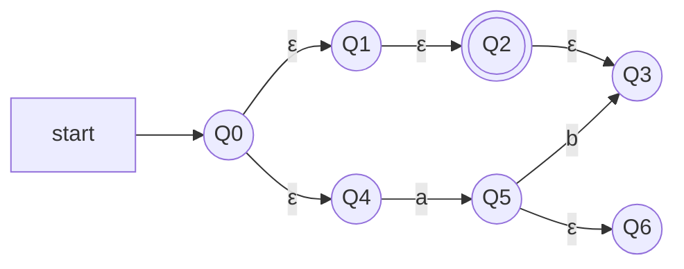

>Un'automa a stati finiti non deterministico con $\epsilon$-transizioni è una quintupla 
>$$A=(Q,\Sigma,\delta, q_o, F )$$ 
>- $Q$ è un insieme finito di stati 
>- $\Sigma$ è un alfabeto finito
>- $\delta$ è una funzione di transizione che prende in input:
>	- uno stato $Q$ 
>	- un simbolo dell'alfabeto $\Sigma \cup\{\epsilon\}$  
>
>- $q_0\in \;Q$ è lo stato iniziale
>- $F \subseteq \;Q$ è un insieme di stati finali 

In parole povere, è un automa in cui ci sono transizioni, dette appunto ***epsilon-transizioni***, dove non "bruciano" alcun carattere.

Hanno la stessa classe degli DFA e NFA, quindi è possibile la conversione :
$$\epsilon-NFA\rightarrow NFA\rightarrow DFA$$

Per fare ciò bisogna elimiare le $\epsilon$-transizioni si procede per ***$\epsilon$-chiusura*** degli stati, ovvero l'insieme di tutti gli stati raggiungibili da $q$ con una sequenza di $\epsilon$. 

>La definizione di **ECLOSE**$(q)$ è per induzione, dove:
>- Case base: $q \in$ **ECLOSE**$(q)$ 
>- Caso induttivo: se $p \in$ **ECLOSE**$(q)$ e $r \in \delta(p,\epsilon)$ allora $r \in$ **ECLOSE**$(q)$   

in questo caso, 
- **ECLOSE**$(q_0)=\{q_0,q_1,q_2,q_3,q_4\}$ 
- **ECLOSE**$(q_5)=\{q_5,q_6\}$ 
- **ECLOSE**$(q_4)=\{q_4\}$

> ***Teorema***
> Un linguaggio $L$ è accettato da un DFA se e solo se è accettato da un $\epsilon$-NFA
> $$\epsilon -NFA \rightarrow DFA$$

