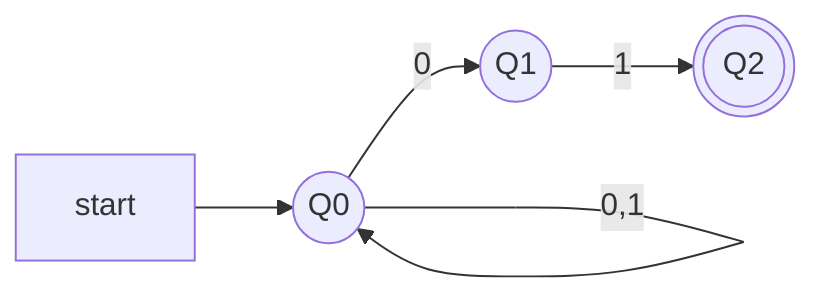

Questo è un'esempio di automa a stati finiti non ***detereministico***. Ha la peculiarità che può trovarsi contemporaneamente in più stati diversi e le transizioni non sono necessariamente complete.

Nel caso sopra:
- da $Q1$ si esce solo leggendo 1 
- da $Q2$ non ha transizioni uscenti
in questi casi il percorso si blocca, ma può proseguire lungo altri rami dell'albero.

>Un'automa a stati finiti non deterministici (*NFA*) è una quintupla 
>$$A=(Q,\Sigma,\delta, q_o, F )$$ 
>- $Q$ è un insieme finito di stati 
>- $\Sigma$ è un alfabeto finito
>- $\delta$ è una funzione di transizione 
>- $q_0\in \;Q$ è lo stato iniziale
>- $F \subseteq \;Q$ è un insieme di stati finali 

L'NFA sopra riconosce solo le parole che terminano con 01 è
$$A=(Q,\{0,1\},\delta, q_0, \{q_2\}$$
dove $\delta$ è la funzione di transizione

|          | 0             | 1           |
| -------- | ------------- | ----------- |
| -> $q_0$ | $\{q_0,q_1\}$ | $\{q_0\}$   |
| $q_1$    | $\emptyset$   | $\{q_2\}$ |
| $q_2$         |  $\emptyset$             |$\emptyset$             |

- Data una parola $w=w_1 \;w_2\; ...\;w_n$, una computazione di una NFA A con input $w$ è una sequenza di stati $r_0\;r_1\;...\;r_n$ che rispetta due condizioni:
	1. $r_0=q_0$ inizia dallo stato iniziale
	2. rispetta le condizioni di transizione

- Diciamo che una computazione accetta la parola $w$ se la computazione termina con uno stati finale.

A causa del nondeterminismo, ci può essere più di una computazione per ogni parola

Infatti un *NFA* A accetta una parola se almeno un ramo dell'albero termina con una computazione che accetta la parola $w$. Invece rifiuta se tutte le computazioni la rifiutano. Formalmente, il linguaggio accettato da A è 
$$L(A)=\{ w \in \Sigma^* | A\;\;accetta\;\;w \}$$

>***Teorema***
>Un linguaggio $L$ è accettato da un DFA se e solo se è accettato da un NFA.
>$$NFA\rightarrow DFA$$

