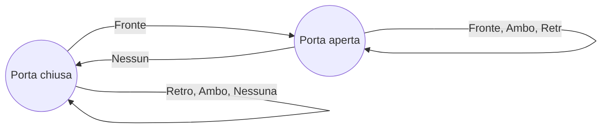

Sono degli [[Automi]] tali che
- Sono il più semplice **modello computazionale**
- Dispongono di una quantità di **memoria finita**
- Sono usati come modello per software, compilatori, ricerca parole, ecc...

Usiamo come esempio una porta automatica:
- La porta si apre quando una persona si avvicina
- Un sensore di fronte alla porta rileva la presenza della persona
- Un sensore sul retro della porta rileva quando la persona haattraversato la porta e se c’è qualcuno dietro la porta

La porta quindi si può trovare in due stati: **Aperta** o **Chiusa**

Ci sono quattro possibili input da sensori: **Fronte**, **Retro**, **Ambo**, **Nessuno**

Quindi se la porta è **chiusa**, rimane chiusa in tutti i casi tranne quandi passa una persona di fronte.
Se, invece, è aperta rimane aperta finchè non ci sarà nessuna persona nelle prossimità.

E' ora di introdurre alcuni concetti di base. 
-  **L'*alfabeto*** che si designa con $\Sigma$, ovvero un insieme finito e non vuoto di simboli

$$\Sigma=\{0,1\}$$
$$\Sigma=\{a,b,c,d,...\}$$
-  ***il concetto di stringa***, ovvero una sequenza finita di simboli da un alfabeto $\Sigma$, con $\epsilon$ che significa stringa vuota
 
- la ***lunghezza*** della stringa espressa con i valore assoluto, quindi
$$|00110|=5$$
$$|\epsilon|=0$$

Le potenze dell'alfabeto sono invece l'insieme delle stringhe di potenza $k$ con simboli presi dall'alfabeto $\Sigma$
$$\Sigma^0=\epsilon$$
$$\Sigma^1=\{0,1\}$$
$$\Sigma^2=\{00,01,10,11\}$$

L'insieme di tutte le stringhe su $\Sigma$ si deonta con $\Sigma^*$ , ovvero

$$\Sigma^*=\Sigma^0 \cup \Sigma^1 \cup \Sigma^2 \cup \Sigma^3\;\cup\;...$$

***Linguaggio***: dato un alfabeto $\Sigma$, chiamiamo linguaggio ogni sottoinsieme
$$L\subseteq \Sigma^*$$
esempi di linguaggi possono essere l'insieme delle parole italiane, l'insieme dei programmi C corretti, ecc...

Se il linguaggio è vuoto si denota con $\emptyset$ , ovvero non contiene nessuna parola, che ***è diverso attenzione*** da un linguaggio che contiene solo la parola vuota, quindi
$$\emptyset\neq \{\epsilon\}$$

di questo ne sono una branchia gli [[Automi a stati finiti deterministici]],  [[Automi a stati finiti non deterministici]], [[Automi a stati finiti con epsilon-transizioni]]