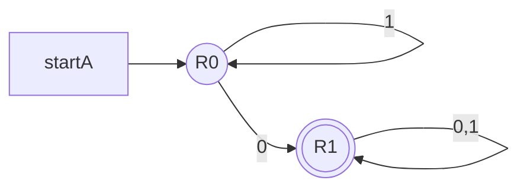
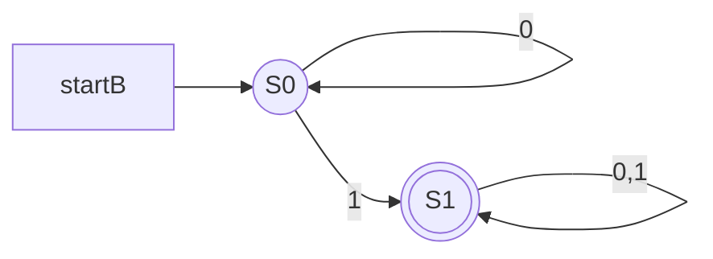
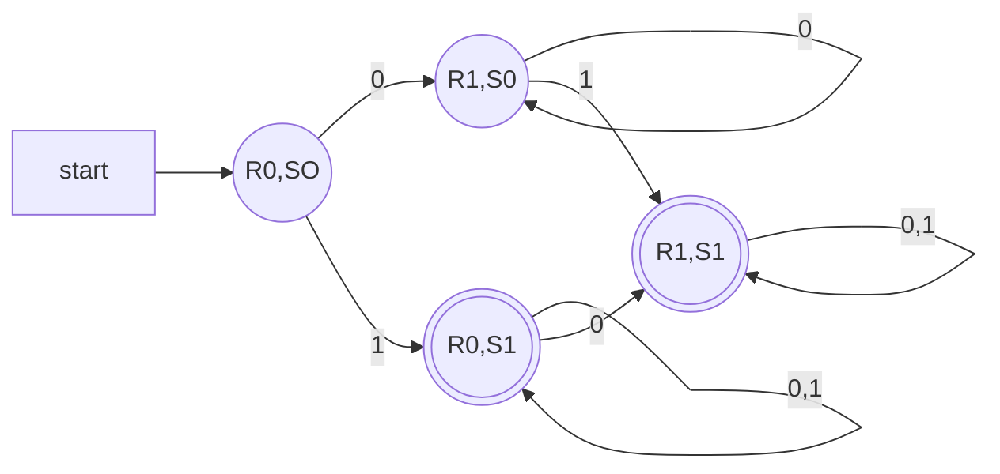

Abbiamo diversi tipi di operazioni che possiamo fare sui linguaggi regolari:

- ***Unione***: $$L\cup M=\{w:w\in L\;oppure \;w \in M\}$$

- ***Intersezione***: $$L\cap M=\{w:w\in L\;e \;w \in M\}$$

- ***Concatenazione***: $$L.M=\{uv: u\in L\;e \;v \in M\}$$

- ***Complemento***: $$\bar L=\{w:w\notin L\}$$
- ***Chiusura di Kleene ( o star )***:  $$L^*=\{w_1w_2...w_k:k\geq0\;\forall w_i \in L\}$$

Se $L$ e $M$ sono linguaggi regolari, allora anche dopo le seguenti operazioni lo saranno.

Adesso facciamo alcuni esempi, costriuamo l'automa che rappresenta l'intersezione di (a) e (b):

l'intersezione di questi due automi dovrà generare un automa che accetta solo il linguaggio che è nello stato finale di entrambi gli automi contemporaneamente. Quindi:

Alcuni esempi delle altre operazioni sono, dato $$L=\{01,010,11\}$$ $$M=\{10,001,110\}$$
$L.M=\{0110,01010,1110,01001,010001,11001,01110,010110,11110\}$ ovvero tutte le possibili combinazioni usando la prima $L$ poi $M$.

$L^*=\{\epsilon, 01,010,11,01010,0111,01011,...\}$ ovvero tutte le combinazioni possibili, ripetendo all'infinto.

