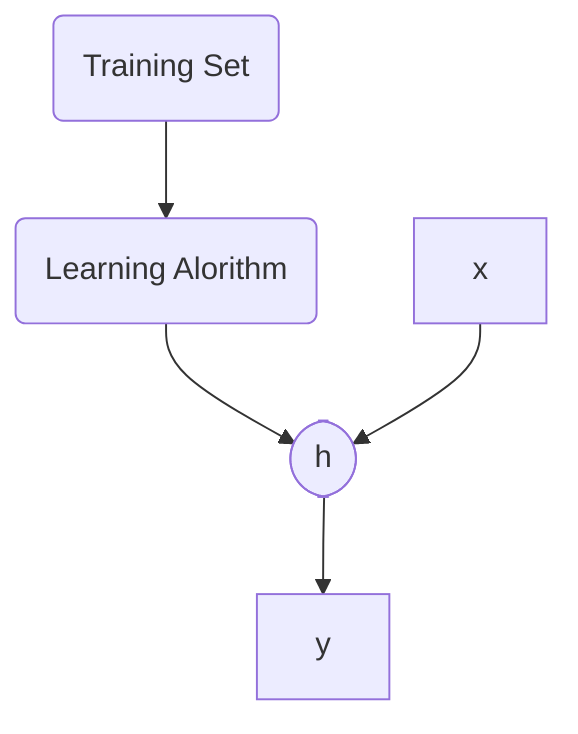

## Supervised Learning

**Obbiettivo**: dare la risposta esatta per ogni esempio di dato

Dati  esempi $\{ x^{(i)}, y^{(i)}\}$ , impara una funzione che cattura le informazioni contenute negli esempi.
Praticamente cerchiamo una funzione $h(\cdot)$ che è in grado di mappare ogni $x^{(i)}$ con la $y^{(i)}$ corrispondente. 
$$h: X \rightarrow Y$$
Alla fine un "oracolo" ci fornirà le giuste correlazioni $x^{(i)}-y^{(i)}$ per vedere se sono giuste

Esempi di ***supervised learning*** possono essere object recognition

## Unsupervised Learning

**Obiettivo**: trovare similarità/regolarità nei dati

Dato un esempio $x^{(i)}$, scopre le similitudini nell'intero dominio dell'input fornito.
A difference del supervised, qui non c'è un oracolo che ti permette di confrontare i risultati.

Esempi di tali algoritmi sono:
- Community detection in a social network
- User/Customer profiling

## Reinforcement Learning
è una tecnica  che punta a realizzare agenti in grado di scegliere azioni da compiere per il conseguimento di determinati obiettivi **tramite interazione con l'ambiente** in cui sono immersi. A differenza degli altri due, questo paradigma si occupa di problemi di decisioni sequenziali, in cui l'azione da compiere dipende dallo stato attuale del sistema e ne determina quello futuro.

- Usato principalmente nella robotica e nell' AI Emboided

## Bias

Solo l'esperienza non ci permette di fare conlcusioni su un dataset unseen. Per questo viene utilizzato l'***inductive bias.***

>L'**inductive bias** è l'insieme delle assunzioni che si usano per predire l'output dati gli input che non ha ancora incontrato

Abbiamo due diversi tipi di bias:
- **Restrizione**: limita lo spazio delle ipotesi
- **Preferenza**: impone ordine nello spazio delle ipotesi

Dare due esempi di inductive bias

> ***Linear regression***: prevede il valore di una variabile in base al valore di un'altra. La variabile che si predice si chiama "*dependent variable*", mentre l'altra *"independent variable"*.

In questo caso il bias induttivo è che questi dati possono essere apporssimati da una relazione lineare.

> ***Nearest neighbors***: riconosce il pattern di classificazione degli oggetti basandosi sulle caratteristiche degli oggetti vicini a quello considerato.

La regola che andrà ad implemetare questo algoritmo è la seguente: quando viene introdotto un nuovo pallino, andra a calcolare, nello spazio di rappresentazione dei dati (bi-dimensionale per il piano cartesiano) la distanza fra il nuovo punto e tutte le istanze che sono nelle vicinanze.

In questo caso il bias induttivo è che i due vicini appartengo allo stesso gruppo. 

___

- L'**errore di bias** è prodotto da assunzioni deboli nell'algoritmo di apprendimento. Un alto bias può fare in modo che l'algoritmo manchi le similitudini più rilevanti tra i punti (***underfiting***).

- L'**errore di varianza** è un errore prodotto da una troppa sensibilità alle piccole fluttuazioni nel training set. Un alta varianza può fare in modo che l'algoritmo modelli i dati sul rumore sentito (***overfitting***). 

