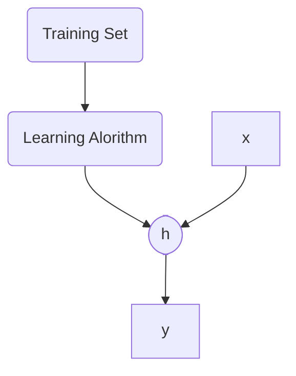

Come già detto, con la regressione lineare ci aspettiamo un ***output continuo***

Per spiegare meglio, userecom come esempio il costo delle case a Portland

| Size feet's | Price in 1k's |
| ----------- | ------------- |
| 2104        | 460           |
| 1416        | 232           |
| 1534        | 315           |
| 852         | 178           |
| ...         | ...              |

Possiamo generalizzare il tutto con :
- x : grandezza della casa
- y : prezzo stimato

e ipotizziamo come funzione che mappa la x con la y la seguente $h$ :
$$h_\theta(x)=\theta_0+\theta_1x$$
che è il nostro modello di regressione lineare univariabile (dal momento che c'è solo $x$ come incognita, quindi monodimensionale). Da notare che la formula è simili ad quella di una retta: $y=mx+q$ .

Adesso che abbiamo il nostro training set (la tabella), la nostra funzione che mappa, ***come scegliamo i parametri***?

L'idea è quella di scegliere un $\theta_0, \theta_1$ in modo che la $h_\theta$ è vicina alla $y$ del nostro training set, quindi accoppiamo $\{(x^{(i)},(y^{(i)})\}$. Una volta fatto ciò, si cerca la retta che ***minimizza i residui***, ovvero la distanza dal punto di coordinate $\{(x^{(i)},(y^{(i)})\}$ ,dalla possibile retta presa in questione. I residui vengono quindi calcolati come:
$$\{h_\theta(x^{(i)})-y^{(i)}\}$$

dove $h_\theta$ è la retta e $y$ è il punto sul piano.

Dichiariamo adesso la nostra ***funzione*** di ***costo*** come:
$$J(\theta_0,\theta_1)=\frac{1}{m} \sum_{i=1}^{m} (h_\theta(x^{(i)})-y^{(i)})^2 $$
ovvero la media quadratica dei valori residui. Il nostro obiettivo è di minimizzare $J(\theta_0,\theta_1)$

Graficamente, sul piano 3D, il grafico sarebbe una cosa di questo tipo

Di solito si parte da una configurazione casuale dei parametri $\theta_0, \theta_1$ , per poi "migliorare il tiro" ed avvicinarsi sempre di più al nostro obiettivo (in questo caso il punto più basso, dato che vogliamo minimizzare la funzione). 

___

### Gradient descent
Tale cosa è possibile farla con il metodo ***gradiant descent***: si avanza di poco verso l'ottimo, cambiando di poco i parametri. L'analogia che si usa è la montagna con la nebbia, per scenderla ed arrivare a valle, bisogna fare "pochi passi" alla volta, dato che non si vede il fondo. L'algoritmo si comporta allo stesso modo, graficamente

Bisogna stare attenti però che con punti iniziali diversi, non sia detto che si finisce sempre in una soluzione ottimale, come il seguente esempio

Se fossimo partiti dal punto più a sinistra, avremo trovato una soluzione migliore, dato che avremo fatto meno strada per arrivare allo stesso risultato.

Quindi, in modo più formale, data una funzione $J(\theta_0,...,\theta_n)$ facciamo piccoli passi verso una direzione con gradiente negativo, ovvero
$$\theta_{j+1}=\theta_j - \eta\nabla  J(\theta_j)$$
- il parametro $\eta>0$ è conosciuto come ***learning rate***
- Dopo ogni aggiornamento, il gradiente viene ricalcolato per  $\theta_{j+1}$ , e il porcesso viene ripetuto fino alla fine
- il termina $\nabla$ sta per derivate parziali, che in due dimensioni corrisponodo alla derivata normale

Occhio a come viene implementata la formula, perché per due variabili, bisogna aggiornare contemporaneamente $\theta_0,\theta_1$ , quindi
$$temp0=\theta_0-\eta \frac{\partial}{\partial \theta_0}J(\theta_0,\theta_1)$$
$$temp1=\theta_1-\eta \frac{\partial}{\partial \theta_1}J(\theta_0,\theta_1)$$
$$\theta_0=temp0\;\;\;\;\;\;\theta_1=temp1$$

___

Nelle due dimensioni, le derivate parziali si comportano proprio come le derivate, che con la formula sopra, ci permette di arrivare fino al fondo

- Nel primo caso $\theta_1=\theta_1-\eta \frac{\partial}{\partial \theta_1}J(\theta_1)$ , quindi la derivata è negativa e cioè si sposta verso destra dato che a $\theta_1$ ci aggiungiamo un qualcosa.
- Nel secondo $\theta_1=\theta_1-\eta \frac{\partial}{\partial \theta_1}J(\theta_1)$ , dove la derivata e positiva quindi a $\theta_1$ sottraiamo un valore e ci spostiamo verso sinistra.

___

Ricordiamo che $\eta$ è il "numero di passi" che facciamo verso il fondo. Bisogna infine stare attenti a prendere un valore $\eta$ nè troppo piccolo, nè troppo grande, infatti:

- se $\eta$ è troppo piccolo ci mettiamo troppa precisione, e quindi l'algoritmo sarà sì più preciso, ma molto più lento dal momento che stiamo facendo passetti piccolissimi

- se $\eta$ è troppo grande è molto peggio del caso precedente, dal momento che è possibile che non si arrivi ad una soluzione per via della interazione della formula che causa aggiornamenti drastici che portano ad un comportamento divergente.

