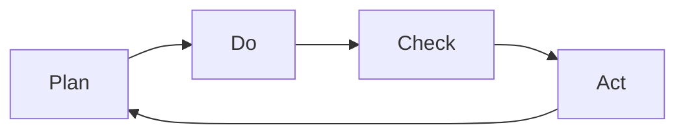
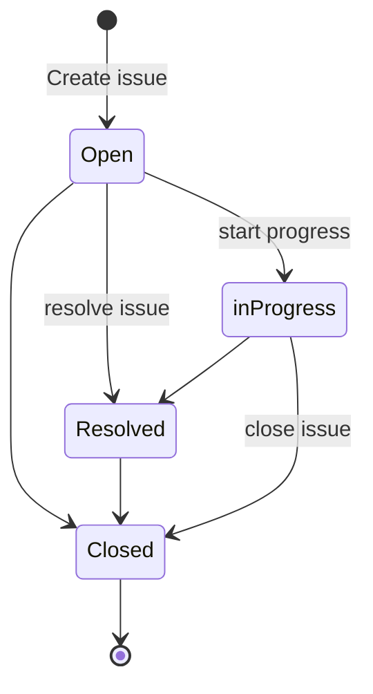

E' un sistema per il tracciamento e mantenimento delle criticità/bug/segnalazioni di un software. Sono generalmente utilizzati in progetti collaborativi.

Sono comunemente utilizzati nelle chiamate all'assistenza clienti di un'azienda per creare, aggiornare e risolvere problemi dei clienti segnalati o addirittura problemi
segnalati dagli altri dipendenti dell'organizzazione.

L'ITS è uno strumento che facilita la gestione del processo di sviluppo e di change management attraverso la gestione di attività diverse (***Work item***) come: analisi requisiti, sviluppo, test, bug, release, deploy, change request, ecc...

Ogni singola attività minima è detta ***Work item*** del progetto ed è gestita mediante un workflow e mantenuta all'interno di un’unica piattaforma e di un unico repository.

#### A cosa serve

- **Condividere le informazioni** con il team di sviluppo, il Project Manager e il cliente: tutto in un unico repository, le info sono visualizzabili tramite dashboard ed è in funzione il sistema di notifiche
- Avere un **istantanea** dello stato del progetto: ovvero le cose da fare, quelle in corso d'opera e quella già terminate
- Decidere **quando** e cosa rilasciare: i *Work Item* possono essere asseganti ad una versione
- Assegnare **priorità** ai work item
- Avere una **chiara assegnazione** delle **attività** e delle **responsabilità**: in tal modo ogni work item riporta l'assegnatario e il segnalante
- **Memoria storica**

#### Caratteristiche di un work item
- **Progetto**: progetto a cui si riferisce 
- **Codice**: identificativo univoco 
- **Riepilogo**: descrizione breve dell’attività 
- **Descrizione**: descrizione esaustiva dell’attività 
- **Tipo**: Categoria del *Work Item* p.es: "Task", "Epic", "Bug", “Requisito”, “Test execution”. Ne determina i campi, gli stati, le schermate e il workflow
- **Stato**: lo stato all’interno del workflow in cui si trova il *Work Item*
- **Priorità**: Importanza del work item in relazione con gli altri work item del progetto 
- **Stato di Risoluzione**: identifica lo stato di risoluzione del work item 
- **Versione di riferimento**: versione del progetto in cui è richiesta l’attività
-  **Componente**: Componente del progetto a cui si riferisce il Work Item 
- **Etichette**: permettono di classificare i *Work Item* anche di diversi tipi. Ne facilitano il raggruppamento e la ricerca 
- **Collegamenti**: permettono di collegare tra di loro i Work Item 
- **Assegnatario**: identifica chi è il responsabile per svolgere l’attività 
- **Segnalante**: identifica chi ha segnalato l’attività 
- **Data di creazione** 
- **Data di ultimo aggiornamento** 
- **Data di risoluzione** 
- **Stima originaria**: stima per lo svolgimento dell’attività 
- **Stima a finire**: stima presunta per terminare l’attività 
- **Tempo speso** 
- **Allegati**

#### Workflow
Il Workflow è un insieme di stati e transizioni che un *Work item* attraversa durante il suo ciclo di vita. In genere permette di implementare il processo da seguire per completare l’attività.
Il *Work item* viene associato ad un **Progetto** e può essere associato ad uno o più **Tipi**.

- I ***collegamenti*** permettono di definire relazione tra i *Work item* anche di differenti tipi (p.es attività e sotto attività, requisito e caso di test). I collegamenti sono bidirezionali: dal/al *Work item.* Vengono registrate e possono essere utilizzate come criterio di ricerca. Questo permette di verificare la presenza o meno di relazione tra i *Work Item*.

- I ***filtri*** permettono di ricercare i *Work item* in base ai campi. possono essere salvati per facilitare le ricerche più frequenti (p.es. I miei *Work items* attivi). I filtri sono la base per creare report, board e dashboard.

- Le ***Board e le Bacheche*** permettono di visualizzare i *Work item* di uno o più progetti, offrendo un modo flessibile e interattivo di visualizzazione, gestione e visualizzare dei dati di sintesi sulle attività in corso. Sono configurati e visualizzano i *Work item* ricercati con un filtro Permette di interagire velocemente con i work items (p.es. Avanzare di stato, modificare alcuni campi).

